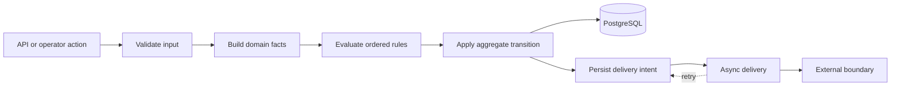

# Evolving Domain Rules in a Long-Lived Backend

Safely changing intertwined business rules through explicit boundaries, focused tests, migrations, staged delivery, rollback, and production diagnosis.

- Development period: Multi-year professional context; exact chronology intentionally generalized
- GitHub publication: Case study first published in 2026
- Context: Long-lived professional backend platform; organization and chronology intentionally generalized.
- Current status: Case-study documentation maintained
- Last verification: 2026-09

## Summary

In a long-lived backend, a small rule change rarely stays small. A new condition can influence navigation, status transitions, calculations, notifications, exports, and external callbacks. The difficult part is not expressing the condition. It is finding every place where the old assumption became part of the system and changing that contract without producing contradictory state.

The approach I use starts by making rule ownership, ordering, and side effects visible. I separate pure decisions from persistence and delivery, characterize existing behavior with focused tests, migrate data additively, and define rollout and rollback before deployment. This has proved more reliable than treating each request as an isolated controller edit.

The source system behind this case study uses PHP, Symfony, Doctrine, PostgreSQL, asynchronous processing, API integrations, and a configurable business-rule layer. Names and examples below are synthetic.

## Context and constraints

The platform supports workflows whose decisions evolve over time. Different configurations may share a default flow while overriding a small subset of rules, templates, thresholds, or integrations. A decision can be triggered from an API request, a back-office action, a scheduled command, or a replayed asynchronous job.

Several constraints shape safe change:

- Existing records were created under older rule sets and cannot simply be reinterpreted.
- A shared rule may have configuration-specific overrides.
- Events can produce more than one side effect, each with different retry behavior.
- Old and new application versions may briefly coexist during rollout.
- A retry must not turn a once-only business event into a duplicate action.
- Tests need to cover the shared mechanism and the meaningful variations without duplicating the entire suite.

The practical consequence is that correctness spans code, configuration, persisted state, and deployment order.

## System boundary

Diagram summary: input is transformed into domain facts, rules derive a decision, the aggregate records the transition, and an outbox-style boundary delivers retryable effects.

The important boundary is between deciding and delivering. A domain transition should be committed with enough durable intent to resume its side effects. The external call should not be the authority for whether the transition occurred, and an in-memory queue should not be the only record that work remains.

## Decisions and trade-offs

### Map the rule graph before editing

I begin with a behavior map rather than a file list:

1. Which facts feed the decision?
2. Which rules read or mutate those facts?
3. Which rule order is significant?
4. Which aggregate fields and lifecycle events change?
5. Which handlers, exports, notifications, or callbacks observe that change?
6. Which configurations override any step?

This exposes hidden coupling early. It also gives review a stable vocabulary: the change is not merely “an extra condition”; it is a change to an input, a decision, a transition, or an effect.

### Keep configuration variation at the edge

When the overall workflow is shared, duplicating it for one configuration creates two systems that will drift. I prefer a shared orchestration path with narrow extension points: a strategy for one computation, a provider for one payload, or a configuration override for one threshold.

The trade-off is that extension points need explicit contracts. An override must state what it may change and what remains invariant. A generic hook with unrestricted access is flexible but makes future reasoning harder.

### Make rule ordering testable

Rules often depend on facts produced by earlier rules. That ordering should be declared and linted instead of living only in comments or incidental file names. For a synthetic example, an eligibility decision might require identity validation before a pricing exception and require both before route selection.

Tests should prove not only that each rule can match, but also that competing rules resolve deterministically and terminate. A bounded maximum firing count is a useful final guard against accidental cycles; it does not replace correct dependency modelling.

### Persist idempotency at the business boundary

Retries are normal. Duplicate business outcomes are not. For once-only delivery, I use a stable business key and a database uniqueness constraint, then enqueue only the transaction that successfully reserved that key.

This is stronger than “check, then insert,” which can race. It also gives operators a durable record to inspect and retry. Repeated events remain possible when repetition is part of the contract, but that choice is explicit.

## Failure modes and safeguards

| Failure mode | Safeguard |
|---|---|
| A narrow rule edit changes an unrelated route | Characterization tests plus a matrix of affected and unaffected paths |
| Configuration-specific behavior replaces shared behavior accidentally | Explicit base-to-override resolution and tests for both paths |
| Two workers publish the same once-only effect | Durable business key and database-enforced uniqueness |
| A deployment mixes incompatible writers | Migration-first or drain-migrate-deploy ordering, documented before rollout |
| A callback fails after domain state commits | Persisted delivery intent with bounded retry and observable status |
| Old records lack a newly required field | Additive migration, defensive read compatibility, and explicit backfill rules |
| A rule cycle never settles | Dependency validation, deterministic ordering, and a firing limit |
| Logs turn an integration failure into a data leak | Structured, redacted failure context without credentials or complete payloads |

## Testing and verification

I layer validation so each level answers a different question:

- **Unit tests** cover pure decisions, edge values, and competing rules.
- **Integration tests** cover Doctrine mappings, migrations, constraints, and transactional reservation.
- **API or behavior tests** cover the user-visible journey across configuration variants.
- **Static analysis** catches incompatible types and unreachable assumptions before runtime.
- **Rule linting** checks syntax, duplicate names, dependency declarations, and forbidden structures.
- **Migration tests** apply forward changes to representative old state and prove rollback or compatibility behavior.
- **Delivery tests** use fake transports to prove retries and idempotency without contacting an external service.

The smallest relevant suite runs during implementation. Before acceptance, the full repository gate and the deployment-specific checks run against the exact head under review. A passing test on an older commit is not evidence for a newer one.

## Outcome and lessons

The durable lesson is that rule-heavy backends need an explicit change protocol. A useful protocol has four linked artifacts: a behavior map, an acceptance matrix, a rollout order, and a rollback path. Together they make the system easier to evolve and the review easier to challenge constructively.

Another lesson is that configurable systems should share mechanisms, not duplicate them. Variation belongs at a narrow edge when the underlying business transition is the same. That keeps fixes, observability, and retry behavior consistent.

Finally, production diagnosis improves when the system records why a decision occurred and which effect remains pending. Observability should expose state and decision categories while continuing to redact sensitive payloads.

## Evidence basis and limitations

This case study is based on verified work in a long-lived Symfony platform with Doctrine persistence, configurable domain rules, asynchronous effects, migrations, and multiple test layers. The diagram and eligibility example are original synthetic material; no private source code or operational data is reproduced.

The study demonstrates an engineering method, not a claim that every legacy path has been redesigned. Exact organizations, domains, timelines, volumes, and business outcomes are intentionally omitted, and no unsupported performance or scale metric is asserted.
