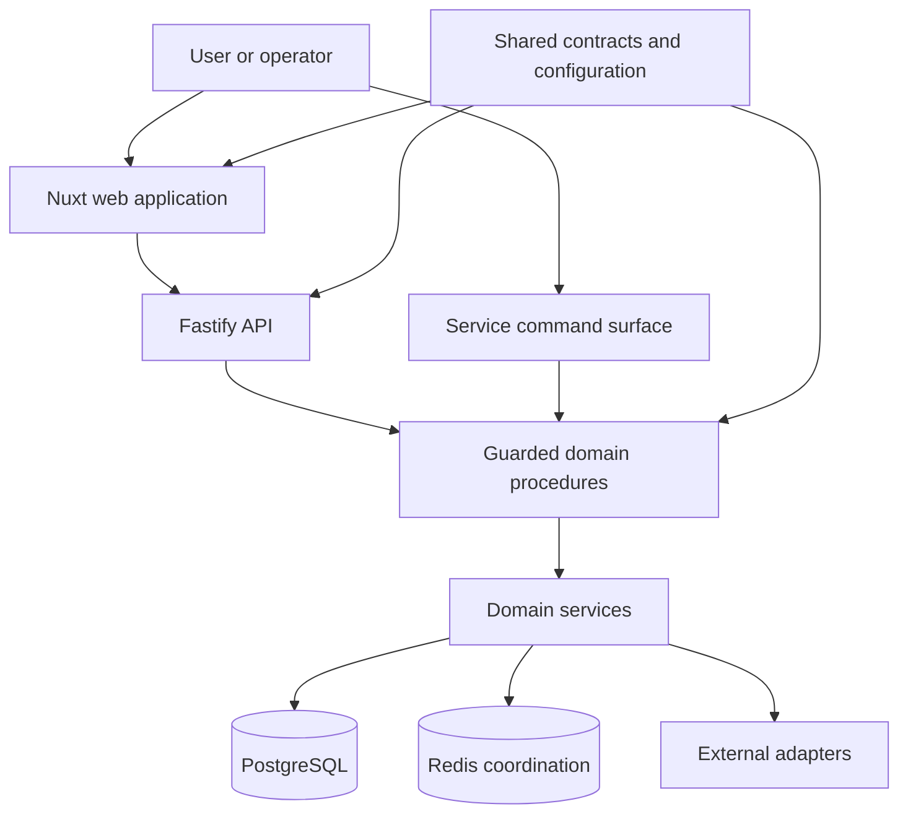

# A Modular TypeScript Platform

Separating domain logic, API contracts, web concerns, persistence, and operational safeguards as a TypeScript system grows.

- Development period: Not precisely documented in this public case study
- GitHub publication: Underlying source is not public
- Context: Personal platform; architecture and examples are sanitized
- Current status: Active implementation; public case-study documentation maintained
- Last verification: 2026-09

## Summary

A useful TypeScript application can grow from one process into a platform without becoming a collection of competing implementations. The key is to decide which component owns each kind of truth, then make dependencies cross explicit contracts instead of reaching through directory or process boundaries.

This case study follows that evolution in a modular system comprising a long-running service, a Fastify API, a Nuxt web application, shared contracts, domain packages, PostgreSQL persistence, Redis-backed coordination, scheduled work, and external integrations. The project is known internally as Habbomon; its source repository is not public.

The engineering focus is broader than the product theme: preserving one domain spine while adding new delivery surfaces, keeping commands thin, making operational switches fail closed, and validating that generated or projected views do not become a second authority.

## Context and constraints

The original application combined commands, scheduled tasks, persistence, integrations, and domain behavior in one TypeScript codebase. Later requirements introduced a web interface and HTTP API. A naive split could have copied rules from the service into API handlers or frontend code, producing several interpretations of the same state.

The platform also has real operational constraints:

- Scheduled jobs must recover after restarts without blindly duplicating a known external outcome.
- External writes must stop when authority or destination configuration is missing.
- The web interface may expose projections but must not bypass established domain procedures.
- Contracts shared between processes need compatibility discipline.
- Database migrations must remain ordered and reproducible.
- Generated assets and configuration need a clear canonical source.
- A large feature surface must still have one understandable validation entry point.

## System boundary

Diagram summary: the service owns domain behavior and side effects, the API exposes guarded operations and projections, the web application consumes those contracts, and shared packages contain types and rules that genuinely belong in more than one process.

The web application owns presentation and interaction state. The API owns authentication, authorization, route guards, and HTTP projections. Neither owns duplicate business rules. Shared packages are deliberately small; “shared” is not a dumping ground for code that has not found an owner.

## Decisions and trade-offs

### Preserve one domain spine

Existing domain procedures remain the path for writes. An API endpoint validates and authorizes the request, then calls the same procedure used by the established command surface. A read endpoint can use a purpose-built projection, but it cannot quietly mutate authoritative state.

This approach can look less convenient than writing feature logic directly in a route. It pays off when a rule changes: one procedure and its tests change, while the API and service remain delivery mechanisms.

### Share contracts, not internals

The workspace separates configuration, wire contracts, and selected domain types into packages with declared dependencies. A package may expose a stable request, response, or projection type. It does not expose database connections, process globals, or concrete adapters simply to avoid an import.

Dependency rules make the intended direction reviewable. Entry points depend on application and domain layers; domain code depends on ports; adapters implement those ports. Forbidden reverse imports are checked automatically where the risk justifies it.

### Keep commands and routes thin

Thin entry points perform four tasks: parse, authorize, invoke, and translate the result. Retry rules, eligibility, state transitions, and persistence belong deeper in the system. This makes entry points easier to audit and prevents behavior from varying by interface.

It also makes testing cheaper. Pure domain behavior can run without HTTP or a platform client, while route tests focus on access and contract translation.

### Treat projections as rebuildable

Frontend-optimized views and caches are useful, but they should identify their authoritative inputs. When possible, a projection can be reconstructed from canonical records. If it cannot, it is not merely a cache and needs the durability and migration rules of authoritative data.

This distinction prevents a common platform failure: two writable stores that disagree, with neither able to explain which value should win.

### Fail closed at operational boundaries

A single explicit operational gate controls classes of active side effect. Missing, blank, false, or unrecognized configuration disables those effects. Registration-time guards stop new schedulers; execution-time guards protect already queued work and direct calls.

The trade-off is deliberate friction during reactivation. Re-enabling work requires a reviewed configuration, durable epoch or state marker, and a validation sequence. Silent fallback to active behavior would be easier and less safe.

## Failure modes and safeguards

| Failure mode | Safeguard |
|---|---|
| API and service implement the same rule differently | Both invoke one domain procedure |
| A frontend treats a projection as writable truth | Explicit read-model contract and server-owned write boundary |
| Two workers claim the same scheduled item | Durable claim/reservation and idempotent local completion |
| A worker crashes after external publication | Stable downstream idempotency key when supported; otherwise record an unknown outcome and reconcile before retrying |
| Missing configuration defaults to external mutation | Fail-closed configuration parsing and execution-time guard |
| A shared package becomes tightly coupled to one process | Dependency rules and narrow exported contracts |
| Migrations execute in an ambiguous order | Timestamped, append-only migration chain with validation |
| Generated output is edited instead of its source | Canonical-source marker and regeneration check |
| One large validation command becomes opaque | Composed focused checks with a documented aggregate gate |

A durable claim prevents concurrent workers from owning the same item, but it cannot create exactly-once behavior across an external boundary. That requires the receiver or broker to honor a stable delivery identity. Without such a contract, a crash after publication but before local completion produces an unknown outcome; recovery must reconcile that outcome rather than automatically publish again.

## Testing and verification

Validation is organized around boundaries:

- Domain tests exercise decisions without external clients.
- Contract tests ensure API, web, and service packages agree on wire shapes.
- Route tests cover authentication, authorization, validation, and error translation.
- Persistence tests cover migrations, uniqueness, recovery, and projection rebuilds.
- Scheduler tests use controlled clocks and fake publishers.
- Adapter tests use fakes or fixtures; normal tests do not contact live providers.
- Static checks enforce types, dependency direction, configuration shape, and repository conventions.
- Build checks prove the API and web packages consume the same reviewed contracts.

One aggregate command defines the local completion gate, but its output identifies which focused stage failed. The exact feature branch and head are recorded before review so a successful run cannot be misapplied to later changes.

## Outcome and lessons

The platform shape supports growth without making the web interface a replacement backend. New surfaces can reuse domain behavior, and projections can evolve without changing authority. Operational gates give maintainers a controlled way to stop side effects while retaining read-only or diagnostic capabilities.

The strongest lesson is that modularity is an ownership decision, not a folder count. A monorepo is useful when package boundaries clarify authority and contracts. It is harmful when packages merely obscure circular dependencies.

Another lesson is to design maintenance and recovery with the feature. Schedulers, retries, and migrations are part of the product behavior, not infrastructure details to add after the happy path.

## Evidence basis and limitations

The architecture described here was verified against a TypeScript workspace containing separate service, Fastify API, Nuxt web, contract, configuration, and domain packages, plus PostgreSQL and Redis integration. The diagram and wording are original. Product-specific commands, identifiers, operational destinations, and private source are omitted.

This case study does not claim that every module has reached the target architecture. It describes the boundaries used for current work and the safeguards that keep incremental migration reviewable.
