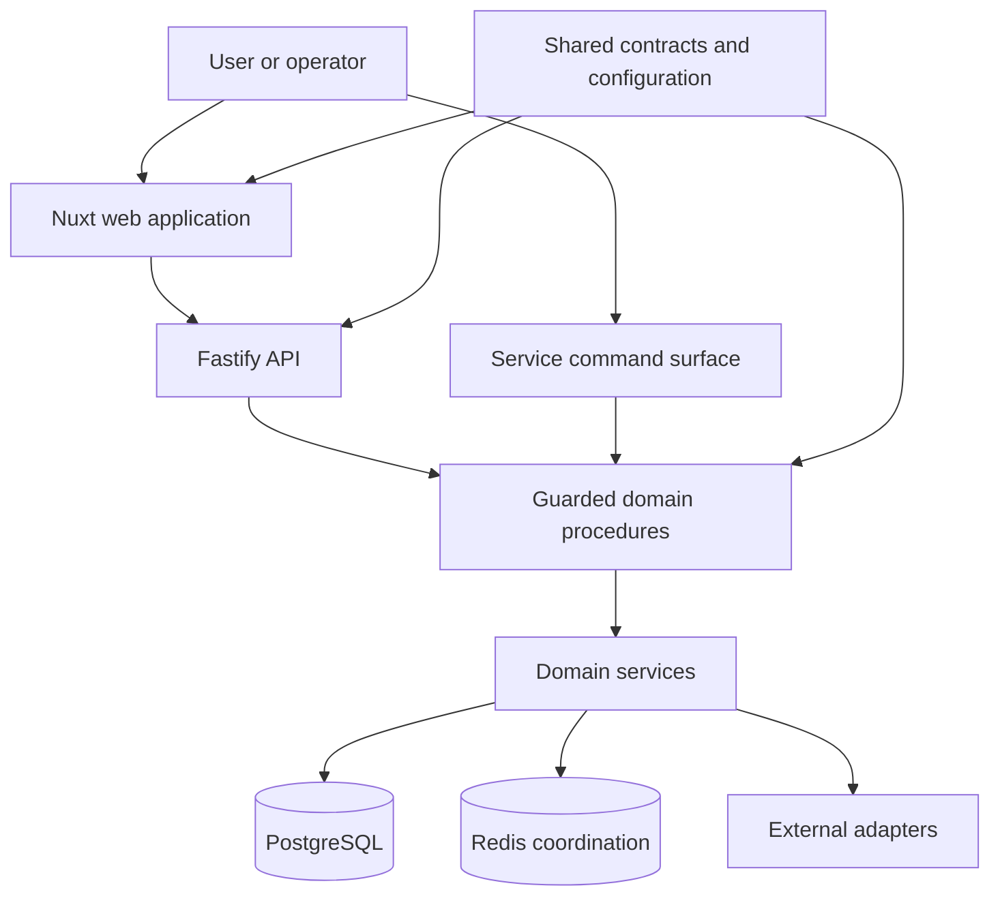

# A Modular TypeScript Platform

General design guidance for separating domain logic, API contracts, web concerns, persistence, and operational safeguards in TypeScript systems.

- GitHub publication: Underlying source is not public
- Context: TypeScript monorepo listed in an approved CV Selected Projects section; no underlying public source
- Documentation status: General architecture guidance maintained; project status is not independently verified here

## Evidence scope

My approved CV's Selected Projects section lists a TypeScript monorepo with a bot, Fastify API, Nuxt/Vue interface, PostgreSQL, Redis, and automated tests. That supports the broad project scope only; it does not establish the architecture, detailed decisions, or failure scenarios below. The public page does not classify the project as employer/client work or infer a personal-project classification from its section placement. Treat the details as general guidance, not a verified feature list or a record that I personally designed or reviewed each detail.

## Summary

A useful TypeScript application can grow from one process into a platform without becoming a collection of competing implementations. The key is to decide which component owns each kind of truth, then make dependencies cross explicit contracts instead of reaching through directory or process boundaries.

The design example below sketches a modular platform with a long-running service, Fastify API, Nuxt web application, shared contracts, domain packages, PostgreSQL persistence, Redis-backed coordination, scheduled work, and external integrations. These details are illustrative guidance and are not independently verifiable from the private source summary.

The guidance focuses on preserving a domain boundary while adding delivery surfaces, keeping entry points thin, making operational switches fail closed, and preventing generated or projected views from becoming a second authority.

## Context and constraints

A TypeScript application may begin with commands, scheduled tasks, persistence, integrations, and domain behavior in one codebase. If later requirements introduce a web interface and HTTP API, a naive split can copy rules into API handlers or frontend code, producing several interpretations of the same state.

Design constraints to evaluate include:

- Scheduled jobs must recover after restarts without blindly duplicating a known external outcome.
- External writes must stop when authority or destination configuration is missing.
- The web interface may expose projections but must not bypass established domain procedures.
- Contracts shared between processes need compatibility discipline.
- Database migrations must remain ordered and reproducible.
- Generated assets and configuration need a clear canonical source.
- A large feature surface must still have one understandable validation entry point.

## System boundary

Illustrative diagram summary: a service owns domain behavior and side effects, an API exposes guarded operations and projections, a web application consumes those contracts, and shared packages contain types that genuinely belong in more than one process.

In a design following this illustration, the web application owns presentation state, the API owns authentication and HTTP projections, and neither duplicates business rules. Shared packages stay small; “shared” is not a dumping ground for code that has not found an owner.

## Decisions and trade-offs

### Preserve one domain spine

One useful pattern keeps domain procedures as the path for writes. An API endpoint validates and authorizes the request, then calls the procedure used by other entry points. A read endpoint can use a purpose-built projection, but it should not quietly mutate authoritative state.

This approach can look less convenient than writing feature logic directly in a route. It pays off when a rule changes: one procedure and its tests change, while the API and service remain delivery mechanisms.

### Share contracts, not internals

An implementation can separate configuration, wire contracts, and selected domain types into packages with declared dependencies. A package may expose a stable request, response, or projection type without exposing database connections, process globals, or concrete adapters simply to avoid an import.

Dependency rules can make the intended direction reviewable: entry points depend on application and domain layers, domain code depends on ports, and adapters implement those ports. Automated checks can flag reverse imports where the risk justifies it.

### Keep commands and routes thin

Thin entry points perform four tasks: parse, authorize, invoke, and translate the result. Retry rules, eligibility, state transitions, and persistence belong deeper in the system. This makes entry points easier to audit and prevents behavior from varying by interface.

It also makes testing cheaper. Pure domain behavior can run without HTTP or a platform client, while route tests focus on access and contract translation.

### Treat projections as rebuildable

Frontend-optimized views and caches are useful, but they should identify their authoritative inputs. When possible, a projection can be reconstructed from canonical records. If it cannot, it is not merely a cache and needs the durability and migration rules of authoritative data.

This distinction prevents a common platform failure: two writable stores that disagree, with neither able to explain which value should win.

### Fail closed at operational boundaries

A design can use a single explicit operational gate for classes of active side effect. Missing, blank, false, or unrecognized configuration disables those effects. Registration-time guards stop new schedulers; execution-time guards protect already queued work and direct calls.

The trade-off is deliberate friction during reactivation. Re-enabling work requires a reviewed configuration, durable epoch or state marker, and a validation sequence. Silent fallback to active behavior would be easier and less safe.

## Failure modes and safeguards

| Failure mode | Safeguard |
|---|---|
| API and service implement the same rule differently | Both invoke one domain procedure |
| A frontend treats a projection as writable truth | Explicit read-model contract and server-owned write boundary |
| Two workers claim the same scheduled item | Durable claim/reservation and idempotent local completion |
| A worker crashes after external publication | Stable downstream idempotency key when supported; otherwise record an unknown outcome and reconcile before retrying |
| Missing configuration defaults to external mutation | Fail-closed configuration parsing and execution-time guard |
| A shared package becomes tightly coupled to one process | Dependency rules and narrow exported contracts |
| Migrations execute in an ambiguous order | Timestamped, append-only migration chain with validation |
| Generated output is edited instead of its source | Canonical-source marker and regeneration check |
| One large validation command becomes opaque | Composed focused checks with a documented aggregate gate |

A durable claim prevents concurrent workers from owning the same item, but it cannot create exactly-once behavior across an external boundary. That requires the receiver or broker to honor a stable delivery identity. Without such a contract, a crash after publication but before local completion produces an unknown outcome; recovery must reconcile that outcome rather than automatically publish again.

## Testing and verification

A validation plan can be organized around boundaries:

- Domain tests exercise decisions without external clients.
- Contract tests ensure API, web, and service packages agree on wire shapes.
- Route tests cover authentication, authorization, validation, and error translation.
- Persistence tests cover migrations, uniqueness, recovery, and projection rebuilds.
- Scheduler tests use controlled clocks and fake publishers.
- Adapter tests use fakes or fixtures; normal tests do not contact live providers.
- Static checks enforce types, dependency direction, configuration shape, and repository conventions.
- Build checks prove the API and web packages consume the same reviewed contracts.

Document an aggregate local completion gate and make its output identify the focused stage that failed. Record the branch and exact head before review so a successful run cannot be misapplied to later changes.

## Outcome and lessons

A platform with these boundaries can grow without making the web interface a replacement backend. New surfaces can reuse domain behavior, projections can evolve without changing authority, and operational gates can stop side effects while retaining read-only or diagnostic capabilities.

The strongest lesson is that modularity is an ownership decision, not a folder count. A monorepo is useful when package boundaries clarify authority and contracts. It is harmful when packages merely obscure circular dependencies.

Another lesson is to design maintenance and recovery with the feature. Schedulers, retries, and migrations are part of the product behavior, not infrastructure details to add after the happy path.

## Evidence basis and limitations

The diagram and wording are original generalized guidance, not a verified source architecture. The approved CV lists broad TypeScript monorepo scope involving a bot, API, web interface, PostgreSQL, Redis, and automated tests, but does not authenticate the detailed boundaries above. This page does not assert a personal or professional ownership category for that selected project.

This page does not claim that any particular project has reached the target architecture or uses these exact boundaries. It describes safeguards that can make an incremental migration reviewable.
