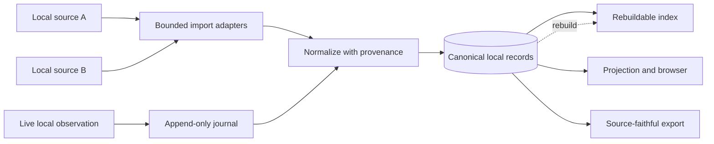

# Trustworthy Local Data Systems

Designing provenance, append-only evidence, uncertainty, deterministic reconstruction, migrations, indexing, and rollback into local-first tools.

- Development period: Not precisely documented in this public case study
- GitHub publication: Underlying source is not public
- Context: Personal local-first applications; architecture and examples are sanitized
- Current status: Active implementations; public case-study documentation maintained
- Last verification: 2026-09

## Summary

Local-first software can offer strong privacy and resilience, but “stored on this computer” is not enough to make its conclusions trustworthy. A useful local data system must show where a record came from, distinguish retained evidence from derived interpretation, survive schema evolution, and make uncertainty visible rather than silently filling gaps.

This case study combines lessons from CacheTyrant and TyrantLedger. Both work with locally retained application artifacts, but at different layers. One focuses on bounded import, normalization, reconstruction, browsing, and export. The other focuses on durable capture, append-only journaling, derived indexes, and guarded projections. Neither underlying source repository is public, and no real content or user identity is reproduced here.

The shared design principle is simple: authoritative evidence is preserved with provenance; projections are rebuildable; exports state what they can and cannot prove.

## Context and constraints

Local application data is often partial. Files may rotate, caches may omit older records, timestamps may represent observation rather than creation, and two sources may contain overlapping representations of one event. Treating every row as equally authoritative creates false certainty.

The systems therefore need to handle:

- multiple local source formats and schema versions;
- large inputs without unbounded reads;
- duplicate or overlapping observations;
- explicit deletions or disappearances;
- attachments or binary evidence with separate retention rules;
- interrupted import, migration, or index construction;
- platform-specific packaging and activation;
- exports that must be source-faithful without overstating completeness;
- privacy boundaries that exclude unrelated local data.

The software must also remain useful offline. Network lookup cannot be the hidden requirement for understanding or verifying a local record.

## System boundary

Diagram summary: immutable or append-only observations enter through bounded adapters, canonical records retain provenance, and rebuildable indexes and exports are derived from that authority.

The canonical layer stores what was observed, where it came from, and how confidently records can be related. The index is an acceleration structure. The browser is a view. The export is a declared interpretation. None silently replaces the canonical record.

## Decisions and trade-offs

### Record provenance at ingestion

An import should preserve a source category, stable source reference where safe, observation time, parser version, and any uncertainty introduced during normalization. If two sources disagree, the conflict remains explainable.

Provenance increases storage and schema complexity. The alternative is more expensive: once normalized data loses its origin, a later fix cannot tell which records need reprocessing.

### Prefer append-only evidence for change events

For observations such as appearance, update, disappearance, or explicit deletion evidence, an append-only journal provides a durable sequence. A current-state table can then be projected from it.

Append-only does not mean immutable forever. Privacy deletion and retention policies still need deliberate procedures. It means ordinary processing does not overwrite the evidence needed to explain how the current state was derived.

### Separate authority from projection

The system identifies one authoritative record layer. Search indexes, desktop views, summary tables, and export caches are projections with a version and a rebuild path. A projection may be deleted and regenerated without losing authority.

This boundary makes corruption recovery tractable. If an index fails an integrity check, the response is to quarantine or rebuild it from canonical records, not to accept its current contents as a competing truth.

### Make uncertainty part of the data model

A reconstructed relationship can be exact, inferred, conflicting, or unknown. Those states should not collapse into a nullable field whose meaning changes by call site.

Explicit uncertainty improves both user experience and tests. The interface can explain why a result is partial, while fixtures can exercise each evidence state without using real personal data.

### Bound input before parsing deeply

Large-file support needs two limits: a small bounded prefix for format detection and a separately configured maximum for normal import. Detection should not read an entire candidate merely to decide what parser to use.

Streaming or chunked processing reduces memory pressure, but it complicates transactions and error reporting. The importer therefore records progress only at safe commit boundaries and reports the source item that failed without copying sensitive content into logs.

### Keep migrations deterministic and recoverable

Each schema version has a single ordered upgrade path. Migrations run transactionally where supported, record their applied version, and do not depend on network state. Before destructive transformation, a local backup or export boundary is explicit.

Forward compatibility is not assumed. A future unsupported schema should fail with a clear instruction rather than being opened and partially rewritten.

## Failure modes and safeguards

| Failure mode | Safeguard |
|---|---|
| Format detection loads a huge file | Read only a bounded prefix, then enforce the import limit |
| Duplicate sources create duplicate records | Stable source identity plus deterministic normalization and deduplication |
| A derived index becomes inconsistent | Versioned projection, integrity check, quarantine, and rebuild |
| Missing evidence is presented as fact | Explicit exact, inferred, conflicting, and unknown states |
| A parser fix changes old results invisibly | Parser version and deterministic reprocessing plan |
| Logs reproduce local content | Structural error categories, bounded excerpts only in controlled diagnostics, redaction by default |
| A migration stops halfway | Transactional migration or checkpointed recovery with version verification |
| An export claims completeness it cannot prove | Export manifest states included sources, exclusions, and limitations |
| Packaging is mistaken for platform validation | Report native, compatibility-layer, and untested platform evidence separately |

## Testing and verification

Real local content is unnecessary for most verification. The test strategy uses synthetic fixtures designed to cover structure and failure modes:

- minimal valid inputs for each supported version;
- duplicates and conflicting observations;
- truncated, malformed, and oversized inputs;
- boundary-sized files around detection and import limits;
- interrupted journal writes and migration failures;
- deterministic reconstruction from the same canonical input;
- index deletion followed by a byte-stable or semantically equivalent rebuild;
- export manifests with explicit source and exclusion fields;
- privacy scans that reject workstation paths, identities, and real-looking content in fixtures;
- SQLite integrity and foreign-key checks where SQLite is the storage engine.

Packaging validation is kept distinct from application semantics. A source package proves that the intended source and lock state were included. A Linux package can receive native smoke coverage. A package run through a compatibility layer is labelled as such rather than being called native platform validation.

## Outcome and lessons

The result is a system whose conclusions can be challenged. A user or maintainer can ask where a record came from, which parser interpreted it, which projection displayed it, and what information was unavailable. Recovery has a defined source of truth instead of relying on whichever database file still opens.

The strongest lesson is to model evidence quality before building a polished browser. Provenance and uncertainty added later are usually incomplete because the original import already discarded context.

Another lesson is that privacy and testability reinforce each other. Synthetic fixtures make the suite portable and shareable, while explicit source boundaries keep both tests and runtime from wandering into unrelated local data.

## Evidence basis and limitations

The described practices were verified against two local-first projects with provenance-aware imports, append-only records, embedded migrations, synthetic fixtures, rebuildable views, guarded exports, and repository-level privacy checks. CacheTyrant uses Python, PySide6, and SQLite; TyrantLedger uses TypeScript and SQLite. This page contains no real records, identities, messages, source paths, screenshots, or investigative output.

Completeness remains source-dependent. Local-first design can preserve and explain available evidence; it cannot manufacture records that were never retained. The case study makes no claim that an export is a complete history beyond its declared inputs.
