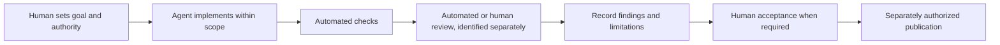

# AI-Assisted Engineering: Scope and Evidence

A practical distinction between human-set goals, agent implementation, automated checks, agent review, and documented human inspection.

- Scope: Recommended engineering process and bounded examples
- Publication status: Guidance, not an audit of every repository or past change

## Summary

AI tools can assist with discovery, implementation, test design, and documentation. Their output does not prove that a feature is correct or that a person inspected its design. A useful engineering record states the task, who or what performed each step, what evidence was produced, and which decisions or checks remain unverified.

This page describes a recommended process. It does not assert that every public repository or historical change followed it. Equipment Service Desk is a user-confirmed exception: a coding agent generated its original demonstration without Wout's supervision.

## Separate the roles

- **Human-defined intent and authority:** State the goal, constraints, allowed changes, protected material, and acceptance criteria. Authorization to run an agent does not establish that the human designed or reviewed its output.
- **Agent implementation:** Record the scope the agent changed. Repository ownership or a commit under a person's account does not by itself prove who wrote, designed, or inspected the change.
- **Automated checks:** Tests and static checks provide evidence only for the command, environment, and source state on which they ran. A documented test command is not a record that it was executed.
- **Agent review:** Identify it as automated review. Its comments or approval do not establish human inspection or acceptance.
- **Human inspection and acceptance:** State what the person actually inspected or decided. If it is unknown, leave it unknown rather than infer it from a merge, reaction, checklist, or permission.

## Recommended workflow

A person defines the task and its boundaries; an agent explores and implements within them; appropriate automated checks run; an independent review evaluates the resulting change; and a person makes any required acceptance and external-delivery decision. Record each step against the relevant change. This is a recommendation, not a retrospective certification that every project used the same sequence.

The diagram describes a proposed process. It is not a verified event history for a specific project.

## Review and evidence

Tie validation to the repository and source revision that produced it. Distinguish local checks, hosted checks, automated review, human review, merge, release, and runtime verification. A later documentation update cannot retroactively establish personal supervision of the original implementation.

When a claim depends on private or otherwise unavailable evidence, summarize only the approved non-identifying fact and disclose that a public reader cannot authenticate its source from the portfolio. Do not copy private code or operational data into a synthetic example and call it anonymized.

## Limits

This page is guidance, not proof that a particular review, deployment, or acceptance occurred. The linked playbook contains reusable recommendations and fictional examples. Each project description must identify its own evidence and status rather than inherit a blanket claim of human verification.
