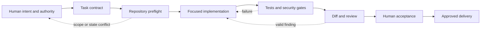

# Verified AI-Assisted Engineering

Using AI within human-owned scope, validation, security, review, and evidence gates rather than treating generated output as accepted work.

- Development period: Ongoing engineering practice
- GitHub publication: Case study first published in 2026
- Context: Cross-stack delivery practice using synthetic examples
- Current status: Maintained documentation
- Last verification: 2026-09

## Summary

AI can accelerate source discovery, implementation, test design, documentation, and review. It can also make an incorrect change look complete faster. The productive unit is therefore not generated code. It is a verified change whose scope, assumptions, side effects, and evidence remain owned by a person.

My workflow treats an AI coding agent as a capable collaborator operating inside an explicit contract. The contract defines the repository, allowed mutations, protected data, acceptance criteria, validation commands, external-action boundaries, and stop conditions. The agent gathers evidence, implements narrowly, and reports limitations. It does not expand authority because a nearby improvement looks convenient.

This case study explains that workflow. A separate public playbook provides reusable templates and tested utilities.

## Context and constraints

The same agent can be asked to work in a PHP monolith, TypeScript workspace, Python desktop application, Java integration, or a workstation runbook. Each environment has different commands and risks, but several constraints recur:

- A working tree may already contain user-owned changes.
- A test can pass against the wrong checkout, runtime, or commit.
- Generated output can contain secrets, personal data, or private paths.
- External actions such as deployment, merging, provider access, and deletion require distinct authority.
- Review feedback may be valid, duplicated, stale, or outside the approved task.
- Hosted CI may be unavailable for administrative reasons without proving a code failure.
- A successful command is not evidence that the requested outcome exists.

The workflow is designed to keep those ambiguities visible.

## System boundary

Diagram summary: a human supplies intent and authority, the agent works inside repository safeguards, automated gates produce evidence, and human acceptance controls external delivery.

The agent can make technical decisions within the contract. It cannot invent authorization for unrelated repositories, production systems, provider accounts, or destructive recovery. Human ownership is expressed through boundaries and checkpoints, not through manual editing of every line.

## Decisions and trade-offs

### Start from a task contract

A useful request identifies the goal, current state, scope, protected inputs, mutation boundaries, validation, and completion condition. It also distinguishes plan-only work from implementation and implementation from deployment.

This adds preparation compared with an open-ended request. It saves time when the repository is complex because the agent can make routine decisions without repeatedly asking for permission, while material expansions remain visible.

### Preflight the actual repository

Before editing, I verify repository identity, checkout root, current branch and HEAD, dirty state, remotes, relevant instruction files, and live pull-request state. Existing changes are evidence, not clutter to reset, stash, or hide.

For multi-repository work, each target gets its own allowlist and base SHA. A drifted repository is re-planned instead of silently rebased into a previously approved diff.

### Separate authority from capability

An agent may be technically capable of merging a pull request, changing cloud configuration, or deleting a stale artifact. That capability does not make the action part of the task. External writes and destructive operations receive explicit checkpoints, exact targets, and rollback consequences.

This distinction is especially important for credentials. Static classification and current-tree cleanup do not authorize live validation against a provider, and repository cleanup does not prove an external service is safe.

### Make validation proportional and layered

Validation starts with the narrowest useful check and expands with risk. A documentation change needs structure, links, rendering, privacy, and diff review. A domain change needs focused tests, integration coverage, static analysis, and the repository gate. A deployment change also needs rollout, smoke, observability, and rollback checks.

The exact reviewed head is part of the evidence. If a substantive follow-up commit is added, the previous review no longer establishes the new head's quality.

### Treat review as an engineering loop

Review findings are classified before implementation: valid and in scope, valid but outside scope, incorrect, duplicate, already resolved, or ambiguous. Valid findings receive the smallest complete fix, a normal follow-up commit, repeated validation, a direct response, and fresh review when behavior changed.

This prevents two opposite failures: blindly applying every suggestion, and dismissing a correct concern because the repository is historical or the reviewer is automated.

### Record evidence without leaking it

Commands, versions, results, head SHAs, and rollback instructions form a durable ledger. Sensitive scanner output is redacted before persistence. Public pull requests summarize validation categories without reproducing credentials, identities, private paths, or audit fingerprints.

The ledger is useful only if it is truthful. A skipped platform test, unavailable hosted runner, or unverified external status remains a limitation rather than being converted into a pass.

## Failure modes and safeguards

| Failure mode | Safeguard |
|---|---|
| Work happens in the wrong checkout | Resolve repository root, remotes, branch, and HEAD before mutation |
| User work is overwritten | Stop on overlapping dirty state; never reset or clean it away |
| The agent broadens the task | Path allowlist, explicit exclusions, and an authority checkpoint |
| Tests pass on an older commit | Record and recheck the validated head SHA |
| A scanner leaks the value it found | Redacted output, private storage, and value-free public summaries |
| A bot suggestion introduces unrelated refactoring | Classify feedback and implement only valid in-scope corrections |
| A deployment succeeds but the product fails | Post-deployment smoke and observable outcome verification |
| Rollback republishes sensitive or broken state | Require separate authorization when rollback itself is risky |
| CI cannot start | Report infrastructure blockage separately from test results |

## Testing and verification

The validation matrix is decided before implementation. Typical layers include:

- repository state and change-scope checks;
- syntax, formatting, and static analysis;
- focused unit or integration tests;
- the documented full local gate;
- secret, personal-data, and private-path scanning;
- generated-artifact and package verification;
- hosted diff and review-thread inspection;
- deployment smoke checks where deployment is separately authorized;
- default-branch verification after merge.

Tests should use synthetic fixtures and fake provider clients. Real external calls are not a shortcut for a missing test harness. When a platform cannot be tested faithfully, the final report identifies exactly what was and was not validated.

## Outcome and lessons

This process makes AI assistance auditable without reducing it to mechanical autocomplete. The agent can explore broadly, reason about trade-offs, and implement substantial changes, while the human retains control over intent, risk, and external consequences.

The central lesson is that verification must be designed into the task. Asking for tests after implementation often produces evidence shaped around the chosen solution. Defining acceptance first makes it possible to discover that the solution is incomplete.

A second lesson is that honesty about limitations improves delivery. “Not tested on native Windows,” “provider status not verified,” or “hosted runner did not allocate” is more useful than a broad green label that conceals the actual boundary.

## Evidence basis and limitations

The workflow is derived from repeated repository maintenance, review closeout, privacy-sensitive remediation, local packaging, deployment handoffs, and system operations across several stacks. All examples on this page are generalized; no private repository path, credential, employer, client, or operational payload is included.

No process can guarantee correctness from checklists alone. The safeguards reduce predictable failure modes and make remaining uncertainty reviewable. Human judgment remains necessary for product intent, proportionality, legal ownership, and irreversible actions.
